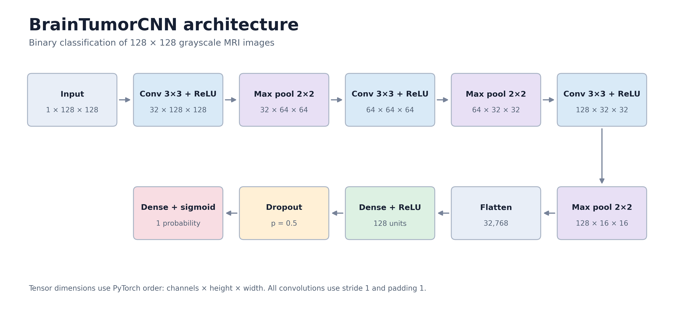
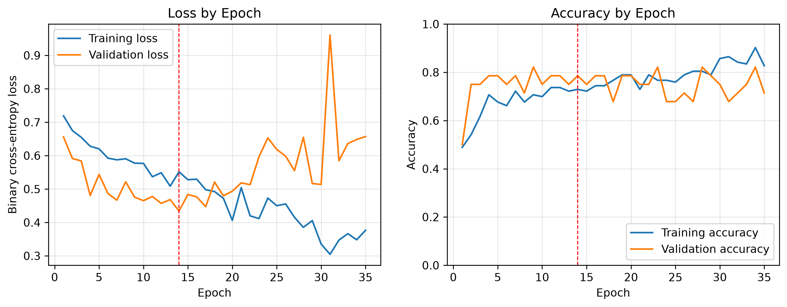
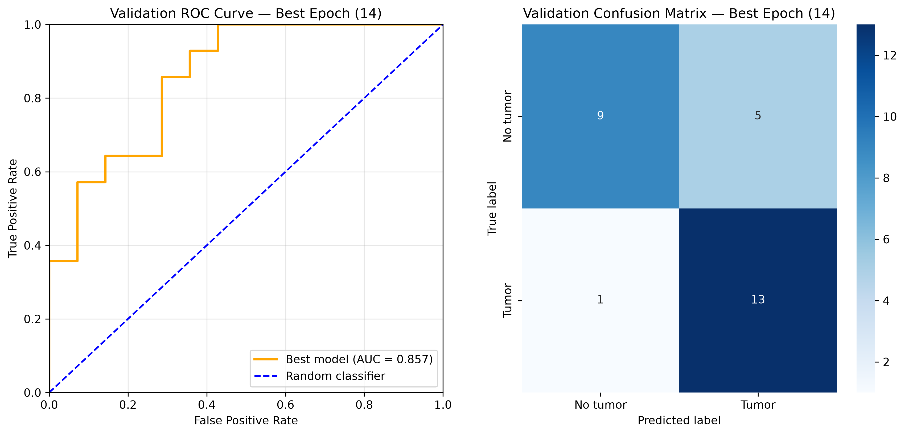

# MRI Tumor Detection Using a Convolutional Neural Network

## Abstract

This project independently reimplemented the model created in the paper *Lightweight CNN for accurate brain tumor detection from MRI with limited training data* by Naeem et al. A dataset of 189 images was constructed from the Kaggle repository cited by the authors and divided into stratified training, validation, and test sets. The reported model architecture, data-augmentation procedures, training configuration and evaluation methods were reproduced in PyTorch. The epoch with the lowest validation loss (0.434) achieved a validation accuracy of 78.6% and ROC-AUC of 0.857, while its test accuracy was 85.7% with a ROC-AUC of 0.878. These results were substantially lower than the approximately 99% validation accuracy and ROC-AUC reported in the original study which also contained a validation loss near zero. Possible explanations include differences in dataset quality, stochastic variation, implementation details across deep-learning frameworks and ambiguities of the published methodology and results.

## Introduction

As the title of the reference article suggests, the study aimed to create an effective computer-assisted diagnostic model for the real-time identification of brain tumors in MRI images using limited data and computational resources. The model was trained on a dataset of 189 MRI images with a nearly equal balance of cancerous and non-cancerous cases. Data-augmentation techniques including horizontal flipping, rotation, zoom, translation, noise injection, and brightness adjustment were applied stochastically during each epoch using TensorFlow's `ImageDataGenerator` class. The training, validation, and test splits were stratified to maintain a balance between cancerous (tumor-positive) and non-cancerous (tumor-negative) cases. The architecture comprised three convolutional layers, each followed by a max-pooling layer, as well as a fully connected hidden layer, a dropout layer, and a fully connected output layer. The architecture was implemented using the TensorFlow Layers API.

*Figure 1. Architecture of the reimplemented CNN. Three convolutional blocks extract image features before a fully connected layer, dropout layer, and sigmoid output produce the tumor-class probability.*

## Implementation

### Data Preprocessing

The MRI images used in this implementation were downloaded from the [Kaggle repository linked in the original article](https://www.kaggle.com/datasets/navoneel/brain-mri-images-for-brain-tumor-detection/data). The dataset contained 155 tumor-positive images and 98 tumor-negative images, which did not match the 95 tumor-positive and 94 tumor-negative images described in the paper. To construct a dataset similar to the one used in the original study, I used Python's `random` library to sample 95 tumor-positive images and 94 tumor-negative images from their respective folders. I then shuffled the images to eliminate any effects of their original ordering before dividing them into training, validation, and test sets.

Using PyTorch's `transforms` module, I reproduced all of the listed data-augmentation techniques except Gaussian noise, which required a custom transformation. The data loaders used a batch size of 18, matching the batch size reported in the original paper.

### Model Creation

I reimplemented the CNN architecture using PyTorch's `nn.Module` class. The network contained three convolutional layers, each followed by a ReLU activation function and a max-pooling layer. The resulting feature maps were then flattened and passed through a fully connected layer with a ReLU activation. A dropout layer randomly set half of the activations to zero before the output was passed through a final fully connected layer with a sigmoid activation function.

### Model Training

The network was trained using binary cross-entropy loss (`BCELoss`) and the Adam optimizer with the learning rate, beta coefficients, and epsilon values reported in the paper. Training and validation loss and accuracy were recorded at each of the 35 epochs to generate loss and accuracy curves. Validation loss, accuracy, precision, recall, F1 score, and ROC-AUC were calculated at each epoch using the `torchmetrics` library. The weights from the epoch with the lowest validation loss were saved along with the corresponding epoch number.

*Figure 2. Training and validation performance across 35 epochs. The left panel shows binary cross-entropy loss, while the right panel shows classification accuracy. The dashed red line marks epoch 14, at which the lowest validation loss was recorded and the model weights were saved.*

### Model Evaluation

The checkpoint with the lowest validation loss was obtained at epoch 14. On the validation set, it achieved a binary cross-entropy loss of 0.4342, accuracy of 0.7857, precision of 0.7222, recall of 0.9286, F1 score of 0.8125, and ROC-AUC of 0.8571. Performance was higher on the test set, with a binary cross-entropy loss of 0.4424, accuracy of 0.8571, precision of 0.8125, recall of 0.9286, F1 score of 0.8667, and ROC-AUC of 0.8776.

ROC curves and confusion matrices were also generated for the validation and test sets using the saved checkpoint.

*Figure 3. ROC curves and confusion matrices for the saved checkpoint on the validation and test sets.*

Overall, the reimplemented network performed substantially worse than the model reported in the original paper. The authors reported a validation loss near zero at epoch 10, along with classification metrics of at least 98.75%.

## Discussion

Several factors could explain the discrepancy between my results and those reported in the paper: stochastic variation during data preprocessing and training, differences between the PyTorch and TensorFlow implementations, differences in dataset quality, errors in my implementation, or inaccurate reporting by the authors.

Stochastic variation alone is unlikely to explain such a substantial decrease in performance, particularly because I repeated the training process using multiple random seeds.

Random sampling and the creation of the training, validation, and test splits may also have affected performance, although I did not repeat the dataset-splitting procedure. If performance is highly dependent on the particular images assigned to each split, this would represent an important obstacle to the authors' goal of increasing accessibility by reducing computational and data requirements.

Differences between PyTorch and TensorFlow are similarly unlikely to account for the full discrepancy, assuming that the model was implemented correctly in both frameworks. Both frameworks are widely used for the tasks performed in this project, making framework choice alone an unlikely explanation for the full discrepancy.

I consider the remaining three explanations more plausible. The possibility of implementation errors could be investigated by continuing to improve my machine-learning skills and seeking feedback from more experienced practitioners.

Differences in dataset quality could be investigated using [other datasets referenced by the authors in their publications](https://www.kaggle.com/datasets/ahmedhamada0/brain-tumor-detection). However, evaluating dataset quality presents an additional challenge because identifying mislabeled MRI images requires specialized subject-matter expertise. Some images labeled as tumor-negative contain regions that appear abnormal and could plausibly represent tumors. Determining whether these images are mislabeled would require greater domain knowledge or collaboration with an expert.

Finally, several inconsistencies in the published article suggest that unclear or inaccurate reporting may have contributed to the difficulty of reproducing its results. In the Results section, the authors state that the loss decreased from 0.412 to nearly zero, whereas the loss curve in Figure 7 appears to begin above 0.6. They also compare their network with a more complex model trained on a larger dataset, for which they report a loss of 0.704 despite accuracy and ROC-AUC values of 98%. Given these apparent inconsistencies, incomplete or inaccurate reporting of the data-processing, model-development, training, or evaluation procedures may have contributed to the lower performance of my reimplementation.

## Reference

Naeem, A. B., Osman, O., Alsubai, S., Cevik, T., Zaidi, A., & Rasheed, J. (2025). Lightweight CNN for accurate brain tumor detection from MRI with limited training data. *Frontiers in Medicine, 12*, 1636059. https://doi.org/10.3389/fmed.2025.1636059